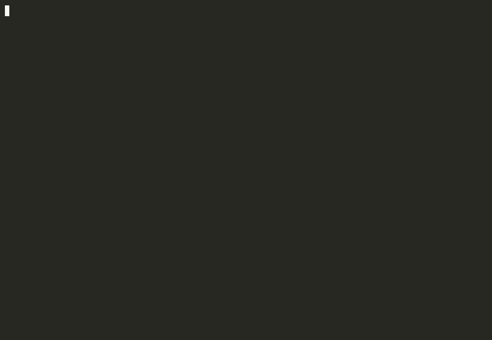

# shipledger-demo

Shipledger checks a release you wrote against local git. It does not generate the release notes, and it does not call GitHub.

This repository has two releases whose notes were typed, not generated:

- **v0.2.0** lists #1 and #2. Both commits are in `v0.1.0..v0.2.0`. The check passes.
- **v0.3.0** lists only #3. The tag also contains #4. The check fails with `unknown-reference`.



_Recorded against this repository with the built CLI; `shipledger` in the recording is a shell function for `node ../shipledger/packages/cli/dist/cli/index.js`. `check` writes `verified-changeset.json` and reports through its exit code, so the recording prints `exit $?` and reads the verdict with `jq`. To re-record, see [docs/record-demo.sh](docs/record-demo.sh)._

## Run it

Shipledger is not on npm yet. Build it, then point it at this clone.

```bash
git clone https://github.com/kacxx/shipledger.git
cd shipledger && npm ci && npm run build
cd ..

git clone https://github.com/kacxx/shipledger-demo.git
cd shipledger-demo

node ../shipledger/packages/cli/dist/cli/index.js check \
  --config shipledger.config.json \
  --changeset changesets/v0.2.0.json

node ../shipledger/packages/cli/dist/cli/index.js check \
  --config shipledger.config.json \
  --changeset changesets/v0.3.0.json
```
